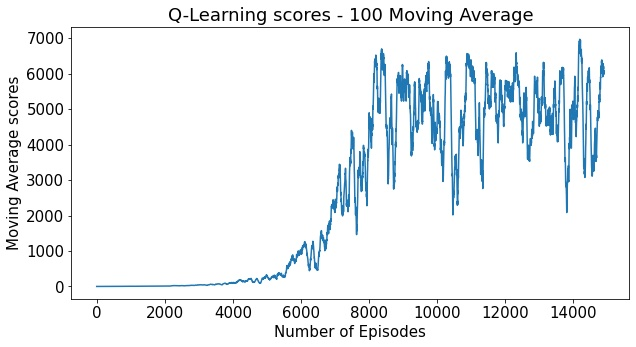
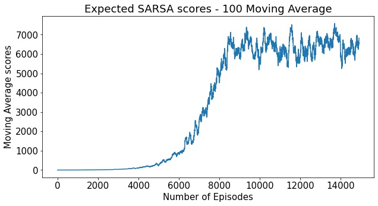

# A Flappy Agent
An implementation of two agents using Reinforcement Learning algorithms in a simple text environment mirroring the famous game "Flappy Bird" as part of a course assignment for Reinforcement Learning in CentraleSupélec.

# 🐦 Flappy Bird Reinforcement Learning Agent  
### Q-Learning & Expected SARSA | Streamlit App

This project implements a **Reinforcement Learning (RL)** agent that learns to play **Flappy Bird** using **Q-Learning** and **Expected SARSA**.  
A custom lightweight environment is used to ensure full compatibility with **Streamlit Cloud**.

🚀 [Live Demo](https://flappy-bird-rl-agent-revanthreddy15.streamlit.app/)  

---

## 🎯 Features

- ✔ Q-Learning Agent  
- ✔ Expected SARSA Agent  
- ✔ Epsilon-Greedy Policy  
- ✔ Custom Flappy Bird environment (no external dependencies)  
- ✔ Reward visualization using Matplotlib  
- ✔ Deploy-ready Streamlit UI  

## 📁 Project Structure

flappy-bird-rl-agent/
│
├── app.py # Streamlit App
├── agent.py # RL Agent (Q-learning & Expected SARSA)
├── flappy_bird_env_simple.py # Custom Flappy Bird environment
├── plot_utils.py # Plot helper
└── requirements.txt # Python dependencies

## Project Content
1 - Selection and Implementation of two off-policy agents: A Q-Learning and Expected SARSA agent have been implemented and tested in a text verison environment of Flappy Bird. Both agents were given an epislon-decaying functionality when selecting an action in the espilon-greedy context.

2 - Hyperparameter Sweep: Finding the optimal step size and epsilon start that yield the greatest rewards for each agent.

3 - Model Comparison: Comparing the value functions, policies, convergence time, and scoring capabilities of both agents.

4 - Game Simulation: A similation of the agents in the game environment to assess their max score abilities

## Results and Dicussion

Both agents performaned considerably and well able to exceed a score of 1000 in the game (in reality trained in a max score of 7000 setting). The expected SARSA agent showed less variance in scoring abilities at convergence (see below). Detailed comparisons can be found in the attached notebook and report.

